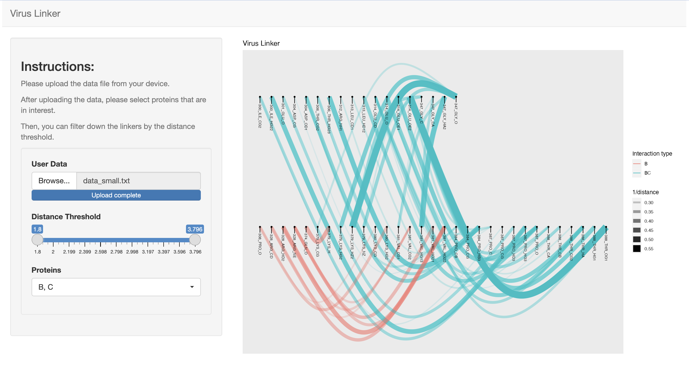

# Virus Linker Shiny App

## Folder Structure
```
virus_linker/                    
├── ShinyApp/                          
│   ├── server.R       
│   ├── ui.R                   
│   ├── global.R
│   ├── get_data.R  
│   ├── linker.R  
├── README.md 
```

- `get_data.R` contains function that will transform the upload data to clean data.

- `linker.R` visualizes the cleaned data.


